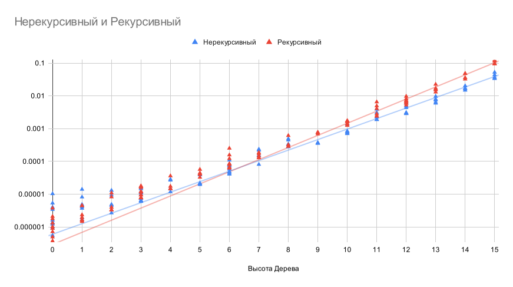

# Время вычисления функции построения бинарного дерева

Сравним время построения бинарного дерева двумя методами (рекурсивный и нерекурсивный). Измерения проводились на локальной машине.

## Измерение №1

> height=5, root=10, left=lambda r: r * 3 + 1, right=lambda r: r * 3 - 1

Нерекурсивный
10000000 loops, best of 5: 20.7 nsec per loop

Рекурсивный
10000000 loops, best of 5: 22.2 nsec per loop

## Измерение №2

> height=0-15, root=10, left=lambda r: r * 3 + 1, right=lambda r: r * 3 - 1

Результаты измерений в логарифмическом масштабе. 

Исходя из результатов измерений можно предположить, что до определенных значений высоты дерева
рекурсивный алгоритм работает быстрее, но на более больших значениях нерекурсивный алгоритм 
эффективнее. 

